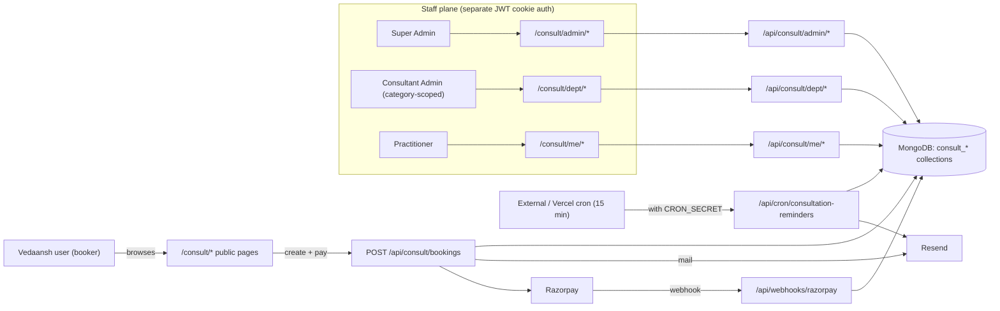
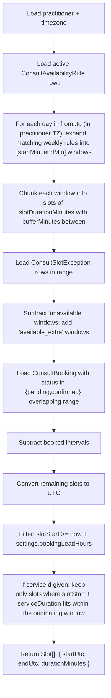
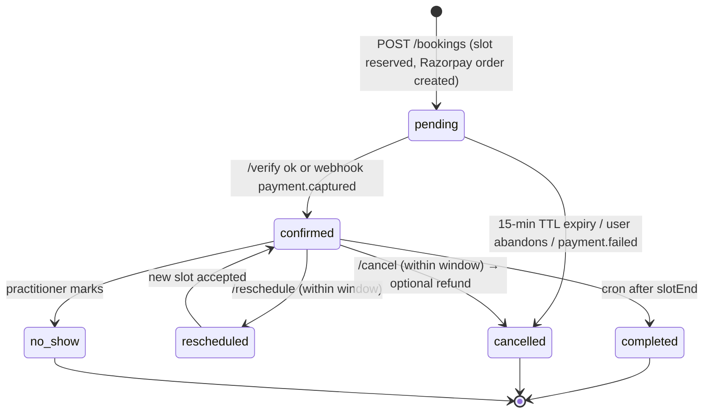
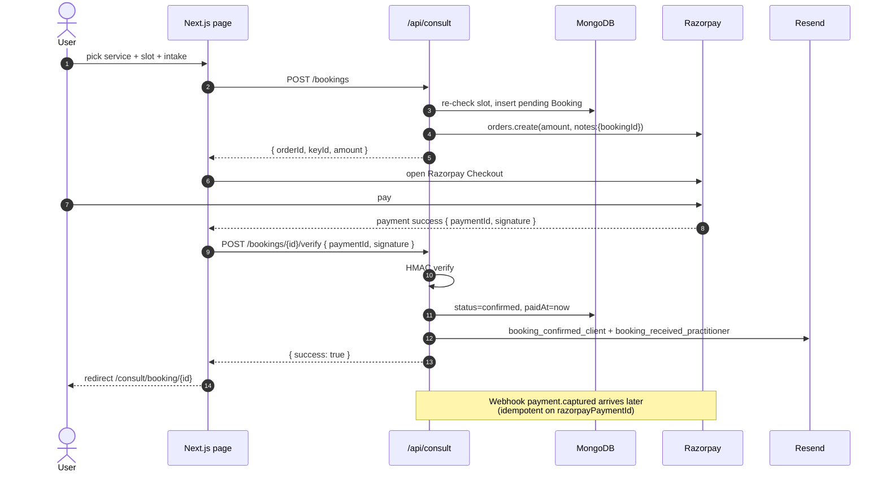

# Consultation Portal — Full Technical Specification

**Version:** 1.0 (MVP)
**Status:** Approved for build
**Owner:** Vedaansh Engineering
**Last updated:** 2026-05-01

---

## 0. Document map

1. [Goals & non-goals](#1-goals--non-goals)
2. [Glossary](#2-glossary)
3. [High-level architecture](#3-high-level-architecture)
4. [Role hierarchy & permissions](#4-role-hierarchy--permissions)
5. [Authentication & authorization](#5-authentication--authorization)
6. [Data model](#6-data-model)
7. [Route map](#7-route-map)
8. [API surface](#8-api-surface)
9. [Slot engine](#9-slot-engine)
10. [Booking lifecycle](#10-booking-lifecycle)
11. [Payments & commission](#11-payments--commission)
12. [Email system](#12-email-system)
13. [Reminder cron](#13-reminder-cron)
14. [Refund & cancellation](#14-refund--cancellation)
15. [Dashboard specifications](#15-dashboard-specifications)
16. [UI / styling guidelines](#16-ui--styling-guidelines)
17. [Environment variables](#17-environment-variables)
18. [File-by-file inventory](#18-file-by-file-inventory)
19. [Phased build plan](#19-phased-build-plan)
20. [Testing strategy](#20-testing-strategy)
21. [Security & compliance](#21-security--compliance)
22. [Operational runbook](#22-operational-runbook)
23. [Out of scope (V2 roadmap)](#23-out-of-scope-v2-roadmap)

---

## 1. Goals & non-goals

### 1.1 Goals

- Add a **fully self-contained Consultation Portal** to the existing Vedaansh Jyotish Platform, accessible at `/consult`, that lets any logged-in Vedaansh user book paid 1:1 sessions with practitioners across multiple categories (astrologers, healers, doctors, vastu experts, tarot readers, etc.).
- Provide **three distinct staff dashboards**:
  - **Super Admin** — global control plane.
  - **Consultant Admin** — per-category (department) manager.
  - **Practitioner** — individual provider.
- Make **everything customizable** without code changes: categories, practitioner profiles, services, prices, slot durations, buffers, weekly availability, per-day exceptions, commission %, cancellation window, reminder lead time, email templates, branding.
- Process payments via **Razorpay**, with platform-collected revenue and a configurable commission split tracked per booking.
- Send **transactional emails** (booking confirmation, practitioner notification, reschedule, cancellation, reminder, refund) via Resend, with DB-driven templates editable by super-admin.
- Keep the consultation system **fully isolated** from the existing astrology product (separate collections, separate staff auth, separate route tree). Only the booker identity is shared with the astrology user account.

### 1.2 Non-goals (V1)

- No integrated video room — practitioner provides a `meetingLink` per booking (Zoom / Google Meet / Jitsi etc.).
- No reviews / ratings UI (data field reserved on `ConsultPractitioner` for V2).
- No automated payouts — settlements are manual, tracked in audit log; Razorpay Route comes in V2.
- No coupons / discount codes.
- No group / multi-attendee sessions.
- No recurring / package bookings.
- No in-app chat.
- No two-way Google / Outlook calendar sync.
- No multi-currency at booking time — V1 ships with one default currency in `ConsultSettings` (INR by default).

---

## 2. Glossary

| Term | Meaning |
|---|---|
| **Booker / Client** | An authenticated Vedaansh user who books a session. Stored in existing `users` collection. |
| **Staff** | Any of `super_admin`, `consultant_admin`, `practitioner`. Stored in new `consult_staff` collection. |
| **Category** | A discipline / department (e.g. "Astrology", "Reiki Healing", "Ayurvedic Doctor"). One Consultant Admin per category. |
| **Practitioner** | An individual provider; belongs to exactly one category. |
| **Service** | A bookable offering by a practitioner (e.g. "30-min Birth Chart Reading — ₹999"). |
| **Slot** | A concrete time window derived from availability rules minus exceptions and bookings. |
| **Booking** | A confirmed (or pending) reservation of a slot for a service by a booker. |
| **Commission** | Platform's cut of a paid booking (`commissionPercent` in `ConsultSettings`). |
| **Net** | Practitioner's earnings after commission. |

---

## 3. High-level architecture



### 3.1 Tech stack (already in repo)

- **Framework**: Next.js 14 App Router + TypeScript
- **DB**: MongoDB (Mongoose) — see [src/lib/db/mongodb.ts](src/lib/db/mongodb.ts)
- **Existing auth (for bookers)**: NextAuth v5 — see [src/auth.ts](src/auth.ts)
- **New auth (for staff)**: Custom HS256 JWT cookie, signed with `AUTH_SECRET`. No new dependency — implemented with Web Crypto.
- **Payments**: `razorpay` package (already a dependency)
- **Email**: `resend` package (already a dependency)
- **Validation**: `zod` everywhere on API boundaries
- **Time / TZ math**: `date-fns` + `date-fns-tz` (already installed)
- **Styling**: Tailwind + the existing CSS variable system in [src/app/globals.css](src/app/globals.css)

### 3.2 Why a separate staff auth?

Mixing `super_admin` / `consultant_admin` / `practitioner` into the existing `User.role` would force the astrology code to know about consultation roles and vice-versa. A separate `consult_staff` collection + a separate cookie keeps the two products **independently deployable, reasonable to reason about, and safer** (a compromised astrology session cannot escalate to staff privileges, and vice versa).

---

## 4. Role hierarchy & permissions

### 4.1 Role tree

```
Platform
├── Super Admin              (one or many; bootstrap via env)
│   └── Consultant Admin     (one per category, owns that category)
│       └── Practitioner     (many per category)
└── Booker                   (any authenticated Vedaansh user)
```

### 4.2 Permissions matrix

| Capability | Super Admin | Consultant Admin (own category) | Practitioner (self only) | Booker |
|---|:---:|:---:|:---:|:---:|
| Create / edit / archive **categories** | yes | no | no | no |
| Invite / suspend **consultant admins** | yes | no | no | no |
| Create / edit / suspend **practitioners** | yes | yes (own category) | edit own profile only | no |
| Edit **practitioner profile** content | yes | yes | own only | no |
| Manage **services** (CRUD) | yes | yes (own category) | own only | no |
| Manage **availability rules + exceptions** | yes (override) | yes (own category) | own only | no |
| View **all bookings** | yes | own category only | own only | own only |
| Cancel a booking on behalf of someone | yes | own category | own | own |
| Issue **refund** | yes | own category | no | request only |
| Edit **email templates** | yes | no | no | no |
| Edit **platform settings** (commission %, etc.) | yes | no | no | no |
| View **revenue / commission reports** | platform-wide | own category | own earnings | no |
| Mark **payout settled** | yes | no | no | no |
| View **audit log** | yes | own category | no | no |

### 4.3 Authorization helpers (`src/lib/consult/auth.ts`)

```ts
requireSuperAdmin()                           // throws 401/403 if not super_admin
requireConsultantAdmin(categoryId?: string)   // super passes; consultant_admin passes only if categoryId matches their own
requirePractitioner(practitionerId?: string)  // super passes; consultant_admin passes within own category; practitioner passes only for their own id
```

---

## 5. Authentication & authorization

### 5.1 Booker auth (unchanged)

Bookers continue to sign in via existing NextAuth flow at `/login`. Their `session.user.id` is the `userId` written on `ConsultBooking`. **No schema changes to the existing `User` model.**

### 5.2 Staff auth (new)

- **Login URL**: `/consult/admin/login` — a single page that accepts email + password and dispatches based on the `role` returned from the server.
- **Endpoint**: `POST /api/consult/auth/login` — validates credentials against `consult_staff`, sets an HttpOnly cookie:

  ```
  Cookie name : vedaansh_consult_session
  Algorithm   : HS256
  Secret      : process.env.AUTH_SECRET
  Payload     : { sid: <staff._id>, role, categoryId?, iat, exp }
  TTL         : 30 days
  Flags       : HttpOnly; Secure (in prod); SameSite=Lax; Path=/
  ```

- **Session helper**: `getStaffSession()` reads the cookie, verifies the signature, returns `{ sid, role, categoryId, staff }` or `null`. Re-fetches `consult_staff` on each call so a `isActive=false` flip immediately revokes access on next request.
- **Logout**: `POST /api/consult/auth/logout` clears the cookie.
- **/me**: `GET /api/consult/auth/me` returns the resolved staff record for client-side hydration.
- **Bootstrap**: `scripts/seed-consult-superadmin.ts` reads `CONSULT_SUPERADMIN_EMAIL` + `CONSULT_SUPERADMIN_PASSWORD` and creates the first `super_admin` row if none exists. Wired as `npm run seed:consult-admin`.

### 5.3 Middleware updates

Extend [middleware.ts](middleware.ts):

```
/consult/admin/*     → require staff cookie, redirect to /consult/admin/login if absent
/consult/dept/*      → require staff cookie with role in {super_admin, consultant_admin}
/consult/me/*        → require staff cookie with role in {super_admin, consultant_admin, practitioner}

/api/consult/admin/* → 401 if no staff cookie
/api/consult/dept/*  → 401/403 enforced in route via requireConsultantAdmin
/api/consult/me/*    → 401/403 enforced in route via requirePractitioner

/consult/book/*      → require NextAuth session, redirect to /login otherwise
```

### 5.4 Login page UX

A single login page handles all three staff roles. After successful login, server returns the role; the client redirects to:

- `super_admin`       → `/consult/admin`
- `consultant_admin`  → `/consult/dept`
- `practitioner`      → `/consult/me`

Practitioners receive an invite email containing a one-time `setPasswordToken` (stored on their `consult_staff` record). They land on `/consult/admin/set-password?token=…`, set a password, and are auto-logged in.

---

## 6. Data model

All consultation collections are namespaced with the `consult_` prefix and live under `src/lib/db/models/consult/`.

### 6.1 `ConsultStaff`

```ts
{
  _id:               ObjectId
  email:             string  // unique, lowercased
  name:              string
  passwordHash:      string | null         // null until invite is accepted
  role:              'super_admin' | 'consultant_admin' | 'practitioner'
  categoryId:        ObjectId | null       // required for consultant_admin & practitioner
  practitionerId:    ObjectId | null       // 1:1 link for role='practitioner'
  isActive:          boolean
  invitedBy:         ObjectId | null
  setPasswordToken:  string | null
  setPasswordExpires: Date | null
  lastLoginAt:       Date | null
  createdAt: Date
  updatedAt: Date
}
```

Indexes: `{ email: 1 }` unique, `{ role: 1, categoryId: 1 }`, `{ practitionerId: 1 }`.

### 6.2 `ConsultCategory`

```ts
{
  _id:           ObjectId
  slug:          string  // unique, kebab-case, used in URLs
  name:          string
  description:   string
  icon:          string  // emoji or icon key
  color:         string  // hex; used for UI accents
  displayOrder:  number
  isActive:      boolean
  intakeFormSchema?: Array<{
    key:      string
    label:    string
    type:     'text' | 'textarea' | 'select' | 'date' | 'checkbox'
    required: boolean
    options?: string[]   // for select
  }>
  createdAt: Date
  updatedAt: Date
}
```

Indexes: `{ slug: 1 }` unique, `{ displayOrder: 1, isActive: 1 }`.

### 6.3 `ConsultPractitioner`

```ts
{
  _id:             ObjectId
  staffId:         ObjectId           // ref ConsultStaff
  categoryId:      ObjectId           // ref ConsultCategory
  slug:            string             // unique, kebab-case, used in URL
  displayName:     string
  headline:        string             // one-liner
  bio:             string             // markdown
  photo:           string | null      // URL
  languages:       string[]           // ['en', 'hi', 'sa']
  specialties:     string[]
  experienceYears: number
  qualifications:  string[]
  timezone:        string             // IANA, e.g. 'Asia/Kolkata'
  isPublished:     boolean
  sortOrder:       number
  ratingAvg:       number             // reserved, default 0
  totalSessions:   number             // denormalized counter
  createdAt: Date
  updatedAt: Date
}
```

Indexes: `{ slug: 1 }` unique, `{ categoryId: 1, isPublished: 1, sortOrder: 1 }`, `{ staffId: 1 }`.

### 6.4 `ConsultService`

```ts
{
  _id:              ObjectId
  practitionerId:   ObjectId
  title:            string
  description:      string
  durationMinutes:  number             // e.g. 30, 45, 60
  priceAmount:      number             // in smallest unit (paise)
  currency:         'INR' | 'USD' | 'EUR'
  mode:             'video' | 'phone' | 'in_person' | 'chat'
  isActive:         boolean
  sortOrder:        number
  createdAt: Date
  updatedAt: Date
}
```

Indexes: `{ practitionerId: 1, isActive: 1, sortOrder: 1 }`.

### 6.5 `ConsultAvailabilityRule`

Weekly recurring availability.

```ts
{
  _id:                 ObjectId
  practitionerId:      ObjectId
  dayOfWeek:           0 | 1 | 2 | 3 | 4 | 5 | 6   // 0 = Sunday
  startMin:            number   // minutes from local midnight, e.g. 540 = 09:00
  endMin:              number   // exclusive end, e.g. 1080 = 18:00
  slotDurationMinutes: number   // chunking interval, e.g. 30
  bufferMinutes:       number   // gap between bookings
  timezone:            string   // IANA — usually mirrors practitioner.timezone
  isActive:            boolean
  createdAt: Date
  updatedAt: Date
}
```

Indexes: `{ practitionerId: 1, dayOfWeek: 1, isActive: 1 }`.

### 6.6 `ConsultSlotException`

Per-date overrides. Two types:

- `unavailable` — practitioner blocks a window (or whole day if no `startMin/endMin`).
- `available_extra` — practitioner adds a window that doesn't fit the weekly rule (vacation make-ups, special hours).

```ts
{
  _id:            ObjectId
  practitionerId: ObjectId
  date:           string                     // 'YYYY-MM-DD' in practitioner.timezone
  type:           'unavailable' | 'available_extra'
  startMin?:      number
  endMin?:        number
  reason?:        string
  createdAt: Date
}
```

Indexes: `{ practitionerId: 1, date: 1 }`.

### 6.7 `ConsultBooking`

```ts
{
  _id:               ObjectId
  bookingCode:       string                  // human-readable, e.g. 'CN-7Y2K9P'
  userId:            ObjectId                // ref User (booker)
  practitionerId:    ObjectId
  serviceId:         ObjectId
  categoryId:        ObjectId

  slotStart:         Date                    // UTC
  slotEnd:           Date                    // UTC
  durationMinutes:   number
  mode:              'video' | 'phone' | 'in_person' | 'chat'
  meetingLink:       string | null

  intake: {
    notes:   string
    answers: Record<string, unknown>         // matches category.intakeFormSchema
  }

  status:           'pending' | 'confirmed' | 'completed' | 'cancelled' | 'rescheduled' | 'no_show'

  priceAmount:        number                 // gross, paise
  commissionPercent:  number                 // snapshot at booking time
  commissionAmount:   number
  netToPractitioner:  number
  currency:           'INR' | 'USD' | 'EUR'

  razorpayOrderId:   string | null
  razorpayPaymentId: string | null
  paidAt:            Date | null
  refundId:          string | null
  refundedAt:        Date | null
  refundAmount:      number | null

  cancellationReason: string | null
  cancelledAt:        Date | null
  cancelledByRole:    'booker' | 'practitioner' | 'consultant_admin' | 'super_admin' | null

  rescheduleHistory: Array<{
    from:        Date
    to:          Date
    reason?:     string
    actorRole:   string
    at:          Date
  }>

  reminderSentAt:  Date | null

  payoutSettled:   boolean                   // for manual settlement tracking
  payoutSettledAt: Date | null

  createdAt: Date
  updatedAt: Date
}
```

Indexes:

- `{ bookingCode: 1 }` unique
- `{ userId: 1, slotStart: -1 }`
- `{ practitionerId: 1, slotStart: 1 }`
- `{ status: 1, slotStart: 1 }`
- `{ razorpayOrderId: 1 }` sparse unique
- `{ razorpayPaymentId: 1 }` sparse unique

Concurrency safeguard: a partial unique index on `{ practitionerId: 1, slotStart: 1 }` filtered by `status ∈ {pending, confirmed}` prevents double-booking the same slot.

### 6.8 `ConsultEmailTemplate`

```ts
{
  _id:          ObjectId
  key:          string                   // unique: 'booking_confirmed_client', etc.
  subject:      string                   // mustache vars allowed
  html:         string                   // mustache vars allowed
  isActive:     boolean
  lastEditedBy: ObjectId | null
  updatedAt:    Date
  createdAt:    Date
}
```

Indexes: `{ key: 1 }` unique.

### 6.9 `ConsultSettings` (singleton)

A single row identified by `{ singleton: 'global' }`.

```ts
{
  singleton:               'global'
  commissionPercent:       number        // e.g. 15
  defaultCurrency:         'INR' | 'USD' | 'EUR'
  brandName:               string
  brandLogo:               string | null
  supportEmail:            string
  defaultBufferMinutes:    number
  defaultSlotMinutes:      number
  reminderHoursBefore:     number        // e.g. 24
  cancellationWindowHours: number        // e.g. 12
  bookingLeadHours:        number        // min hours between now and slot start
  maxAdvanceBookingDays:   number        // e.g. 60
  updatedAt: Date
}
```

### 6.10 `ConsultAuditLog`

```ts
{
  _id:         ObjectId
  actorStaffId: ObjectId | null
  actorRole:    string
  action:       string                   // e.g. 'category.create', 'booking.refund'
  targetType:   string                   // 'category' | 'practitioner' | 'booking' | …
  targetId:     ObjectId | null
  payload:      Record<string, unknown>  // before/after diff, sanitized
  ip:           string
  userAgent:    string
  createdAt:    Date
}
```

Indexes: `{ createdAt: -1 }`, `{ actorStaffId: 1, createdAt: -1 }`, `{ targetType: 1, targetId: 1 }`.

---

## 7. Route map

### 7.1 Public (booker) pages

| Route | Purpose |
|---|---|
| `/consult` | Landing — hero + category grid + featured practitioners |
| `/consult/[categorySlug]` | Practitioner directory in a category, with filters |
| `/consult/p/[practitionerSlug]` | Practitioner profile + service list + slot picker |
| `/consult/book/[serviceId]?start=…` | Intake form + summary + Razorpay handoff |
| `/consult/booking/[bookingId]` | Post-payment confirmation page |
| `/my/consultations` | Booker's own bookings: upcoming + past, with cancel / reschedule actions |

### 7.2 Staff pages

| Route | Required role |
|---|---|
| `/consult/admin/login` | (anyone) |
| `/consult/admin/set-password` | invited staff with valid token |
| `/consult/admin` | super_admin |
| `/consult/admin/categories` | super_admin |
| `/consult/admin/admins` | super_admin |
| `/consult/admin/practitioners` | super_admin |
| `/consult/admin/bookings` | super_admin |
| `/consult/admin/revenue` | super_admin |
| `/consult/admin/email-templates` | super_admin |
| `/consult/admin/settings` | super_admin |
| `/consult/admin/audit` | super_admin |
| `/consult/dept` | consultant_admin (or super) |
| `/consult/dept/practitioners` | consultant_admin |
| `/consult/dept/bookings` | consultant_admin |
| `/consult/dept/revenue` | consultant_admin |
| `/consult/me` | practitioner (or super / consultant_admin viewing-as) |
| `/consult/me/profile` | practitioner |
| `/consult/me/services` | practitioner |
| `/consult/me/availability` | practitioner |
| `/consult/me/bookings` | practitioner |
| `/consult/me/earnings` | practitioner |

---

## 8. API surface

All `/api/consult/*` routes return JSON envelopes: `{ success: true, data }` or `{ success: false, error: { code, message, details? } }`.

### 8.1 Auth

| Method | Path | Auth | Purpose |
|---|---|---|---|
| POST | `/api/consult/auth/login` | none | email + password → set staff cookie |
| POST | `/api/consult/auth/logout` | staff | clear cookie |
| GET  | `/api/consult/auth/me` | staff | resolve current staff |
| POST | `/api/consult/auth/set-password` | one-time token | accept invite, set password |

### 8.2 Public catalog

| Method | Path | Auth | Purpose |
|---|---|---|---|
| GET | `/api/consult/categories` | none | active categories, ordered |
| GET | `/api/consult/practitioners?category=&q=&lang=` | none | published practitioner directory |
| GET | `/api/consult/practitioners/[slug]` | none | profile + active services |
| GET | `/api/consult/practitioners/[id]/slots?from=&to=` | none | free slots in range |

### 8.3 Booking

| Method | Path | Auth | Purpose |
|---|---|---|---|
| POST | `/api/consult/bookings` | booker (NextAuth) | create pending booking + Razorpay order |
| POST | `/api/consult/bookings/[id]/verify` | booker | verify Razorpay signature → confirm |
| GET | `/api/consult/bookings/[id]` | booker (own) / staff | booking detail |
| POST | `/api/consult/bookings/[id]/cancel` | booker / staff | cancel + optional refund |
| POST | `/api/consult/bookings/[id]/reschedule` | booker / staff | move to a new slot |
| POST | `/api/consult/bookings/[id]/refund` | super / consultant_admin | issue Razorpay refund |
| GET | `/api/consult/me/bookings/list` | booker | own bookings |

### 8.4 Practitioner self-service

| Method | Path | Auth |
|---|---|---|
| GET / PATCH | `/api/consult/me/profile` | practitioner |
| GET / POST / PATCH / DELETE | `/api/consult/me/services[/id]` | practitioner |
| GET / POST / PATCH / DELETE | `/api/consult/me/availability[/id]` | practitioner |
| GET / POST / DELETE | `/api/consult/me/exceptions[/id]` | practitioner |
| GET | `/api/consult/me/bookings` | practitioner |
| GET | `/api/consult/me/earnings?from=&to=` | practitioner |

### 8.5 Consultant Admin (dept-scoped)

| Method | Path | Auth |
|---|---|---|
| GET / POST / PATCH / DELETE | `/api/consult/dept/practitioners[/id]` | consultant_admin |
| GET | `/api/consult/dept/bookings` | consultant_admin |
| GET | `/api/consult/dept/revenue` | consultant_admin |
| GET | `/api/consult/dept/stats` | consultant_admin |

### 8.6 Super Admin

| Method | Path | Auth |
|---|---|---|
| GET / POST / PATCH / DELETE | `/api/consult/admin/categories[/id]` | super |
| GET / POST / PATCH / DELETE | `/api/consult/admin/staff[/id]` | super |
| GET / POST / PATCH / DELETE | `/api/consult/admin/practitioners[/id]` | super |
| GET | `/api/consult/admin/bookings` | super |
| GET | `/api/consult/admin/revenue` | super |
| GET | `/api/consult/admin/stats` | super |
| GET / PATCH | `/api/consult/admin/settings` | super |
| GET / POST / PATCH / DELETE | `/api/consult/admin/email-templates[/key]` | super |
| POST | `/api/consult/admin/email-templates/[key]/test` | super |
| POST | `/api/consult/admin/payouts/[bookingId]/settle` | super |
| GET | `/api/consult/admin/audit` | super |

### 8.7 Webhooks & cron

| Method | Path | Auth |
|---|---|---|
| POST | `/api/webhooks/razorpay` | Razorpay HMAC | extended for `payment.captured`, `payment.failed`, `refund.processed` on consultation orders |
| POST | `/api/cron/consultation-reminders` | `Authorization: Bearer ${CRON_SECRET}` |

---

## 9. Slot engine

`src/lib/consult/slots.ts`

### 9.1 Inputs

- `practitionerId`
- `from: Date` (UTC)
- `to: Date` (UTC, inclusive cap; max `settings.maxAdvanceBookingDays` ahead)
- Optional `serviceId` — if given, output is filtered to slots wide enough for that service's `durationMinutes`.

### 9.2 Algorithm



### 9.3 Concurrency / atomicity

When a booker submits `POST /api/consult/bookings`:

1. Re-run the slot engine for the requested window.
2. If the requested `start` is no longer free → return `409 SLOT_TAKEN`.
3. Insert `ConsultBooking` with status `pending`. The partial unique index on `{practitionerId, slotStart}` filtered by `status ∈ {pending, confirmed}` enforces single-occupancy at the DB level — a duplicate insert fails fast.
4. Create Razorpay order with `notes: { bookingId, bookingCode }` and return `{ orderId, keyId, amount, currency }`.

Pending bookings auto-expire after 15 minutes if not verified — a cleanup job (or lazy check) flips `status` from `pending` to `cancelled` so the slot is freed.

---

## 10. Booking lifecycle



### 10.1 Sequence — happy path



---

## 11. Payments & commission

### 11.1 Pricing snapshot

At booking creation, the booking row freezes:

- `priceAmount`         = `service.priceAmount`
- `commissionPercent`   = `settings.commissionPercent` (snapshot)
- `commissionAmount`    = `Math.round(priceAmount * commissionPercent / 100)`
- `netToPractitioner`   = `priceAmount - commissionAmount`
- `currency`            = `service.currency` (must match `settings.defaultCurrency` in V1)

This guarantees that later changes to `settings.commissionPercent` or `service.priceAmount` do **not** rewrite history.

### 11.2 Razorpay flow

- `orders.create({ amount, currency, receipt: bookingCode, notes: { bookingId, type: 'consult' } })`
- Verify on `/verify` using `razorpay_payment_id|razorpay_order_id` HMAC with `RAZORPAY_KEY_SECRET`.
- Webhook `/api/webhooks/razorpay` (extended) handles late events idempotently:
  - `payment.captured`  → ensure `confirmed`
  - `payment.failed`    → ensure `cancelled` if still `pending`
  - `refund.processed`  → write `refundId`, `refundedAt`, `refundAmount`

### 11.3 Practitioner earnings

`/consult/me/earnings`:

- Filters: date range, status.
- Aggregates: gross, commission, net, count of bookings, breakdown per service.
- `payoutSettled` flag indicates whether super-admin has marked this booking as paid out manually.

### 11.4 Manual settlement (V1)

Super admin sees an "Outstanding payouts" view grouped by practitioner. Marking settled:

- Sets `payoutSettled = true` and `payoutSettledAt = now` on each included booking.
- Writes a `ConsultAuditLog` entry (`action: 'payout.settle'`, `payload: { bookingIds, amount, mode }`).

---

## 12. Email system

### 12.1 Templates

Each template has a stable `key`, a default coded version (in `src/lib/consult/email-defaults.ts`), and an optional override row in `consult_email_templates`. The sender always:

1. Looks up `consult_email_templates` by `key` and `isActive: true`.
2. Falls back to the coded default if absent.
3. Renders mustache-style variables.

| Key | Recipient | Trigger |
|---|---|---|
| `booking_confirmed_client` | booker | after successful verify |
| `booking_received_practitioner` | practitioner | after successful verify |
| `booking_rescheduled` | booker + practitioner | after reschedule |
| `booking_cancelled` | booker + practitioner | after cancel |
| `booking_reminder` | booker (+ practitioner) | reminder cron |
| `booking_refunded` | booker | after refund |
| `staff_invite` | invited staff | super/dept invites a new staff |

### 12.2 Variables (common)

`{{userName}}`, `{{practitionerName}}`, `{{categoryName}}`, `{{serviceTitle}}`, `{{durationMinutes}}`, `{{slotStartLocal}}`, `{{slotStartIso}}`, `{{timezone}}`, `{{meetingLink}}`, `{{bookingCode}}`, `{{priceFormatted}}`, `{{cancelUrl}}`, `{{rescheduleUrl}}`, `{{supportEmail}}`, `{{brandName}}`, `{{brandLogoUrl}}`.

### 12.3 Editor UX

`/consult/admin/email-templates`:

- List of all keys with last-updated timestamp and a green/grey active dot.
- Editor: subject input, monospace HTML editor (textarea is fine for V1), live preview pane (right side), variable hint cheatsheet, "Send test to me" button.

---

## 13. Reminder cron

- Endpoint: `POST /api/cron/consultation-reminders`
- Auth: `Authorization: Bearer ${CRON_SECRET}` header check.
- Run cadence: every 15 minutes.
- Query:

  ```
  status: 'confirmed'
  reminderSentAt: null
  slotStart: between (now + reminderHoursBefore - 15 min) and (now + reminderHoursBefore + 15 min)
  ```

- For each match, send `booking_reminder` to booker (and optionally practitioner), set `reminderSentAt = now`.
- Idempotent: setting `reminderSentAt` is the dedupe key.

---

## 14. Refund & cancellation

### 14.1 Booker-initiated cancel

- Allowed only if `slotStart - now > settings.cancellationWindowHours`.
- If allowed and `paidAt` exists, automatically issue a full Razorpay refund.
- Status → `cancelled`, `cancellationReason`, `cancelledByRole = 'booker'`, write audit log.
- Send `booking_cancelled` + (if refunded) `booking_refunded`.

### 14.2 Staff-initiated cancel / refund

- Super admin and consultant admin (own category) can cancel + refund **at any time**.
- Practitioner can cancel but cannot refund directly — they trigger an email to consultant admin who issues the refund.
- Refund endpoint accepts `amount` (defaults to full).

### 14.3 Reschedule

- Booker can reschedule once if `slotStart - now > settings.cancellationWindowHours`.
- Picks a new free slot of the same service / duration.
- Old slot freed, new slot reserved atomically (single transaction-ish operation).
- Push `{ from, to, actorRole, at }` to `rescheduleHistory`.
- Send `booking_rescheduled`.

---

## 15. Dashboard specifications

### 15.1 Super Admin (`/consult/admin`)

Top-level stat cards:

- Today's bookings (count + total)
- Gross revenue (this month)
- Commission earned (this month)
- Active practitioners

Charts:

- Revenue last 30 days (line)
- Bookings by category (bar)
- Top 5 practitioners by revenue (table)

Sub-pages: as listed in [§7.2](#72-staff-pages). Each list page has search, filters, pagination, CSV export.

### 15.2 Consultant Admin (`/consult/dept`)

Same shape as super, **scoped to `categoryId`**:

- Practitioner roster for the category
- Bookings list (category-only)
- Revenue (category-only)
- Pending invites

### 15.3 Practitioner (`/consult/me`)

- **Home**: today's schedule (timeline), this week's calendar, upcoming bookings (next 5), recent cancellations.
- **Profile**: edit `displayName`, `headline`, `bio`, `photo`, `languages`, `specialties`, `qualifications`, `timezone`.
- **Services**: CRUD with sort.
- **Availability**: weekly rule editor (7-day grid with add/remove windows per day), slot duration / buffer, "Block date" button for exceptions.
- **Bookings**: list, mark `completed` / `no_show`, attach `meetingLink`, view intake.
- **Earnings**: gross / commission / net per period, with detail table.

---

## 16. UI / styling guidelines

- Reuse existing CSS variables in [src/app/globals.css](src/app/globals.css) (`--surface-1`, `--gold`, `--accent`, `--text-muted`, etc.).
- Reuse the admin shell pattern from [src/components/admin/AdminShellClient.tsx](src/components/admin/AdminShellClient.tsx). Build a parallel `src/components/consult/ConsultShellClient.tsx` that:
  - Reads `getStaffSession()`.
  - Renders different sidebars based on role (`super_admin` / `consultant_admin` / `practitioner`).
  - Provides a global "Acting as: <role>" pill in the header.
- Public consultation pages get a polished landing matching the existing Vedaansh aesthetic — gold accents on dark surfaces, rounded `var(--r-lg)` cards, generous spacing.
- All forms use Zod schemas shared between client and server.
- All amounts displayed via a `formatMoney(amount, currency)` helper that handles paise → rupees, etc.
- All times displayed in the booker's locale via `Intl.DateTimeFormat`, but always include the practitioner's timezone label next to the slot.

---

## 17. Environment variables

Add to [.env.example](.env.example):

```bash
# ── Consultation Portal ──────────────────────────────────────
# Bootstrap super-admin (one-time; ignored after first run)
CONSULT_SUPERADMIN_EMAIL=admin@vedaansh.com
CONSULT_SUPERADMIN_PASSWORD=change-me-immediately

# Cron auth (used by /api/cron/consultation-reminders)
CRON_SECRET=replace-with-32-byte-random
```

Reused (already present):

- `AUTH_SECRET` — also signs the staff JWT cookie.
- `MONGODB_URI`, `MONGODB_DB_NAME`
- `RAZORPAY_KEY_ID`, `RAZORPAY_KEY_SECRET`, `RAZORPAY_WEBHOOK_SECRET`
- `RESEND_API_KEY`, `FROM_EMAIL`
- `NEXT_PUBLIC_APP_URL`, `NEXT_PUBLIC_APP_NAME`

---

## 18. File-by-file inventory

### 18.1 New files

```
src/lib/db/models/consult/
  ConsultStaff.ts
  ConsultCategory.ts
  ConsultPractitioner.ts
  ConsultService.ts
  ConsultAvailabilityRule.ts
  ConsultSlotException.ts
  ConsultBooking.ts
  ConsultEmailTemplate.ts
  ConsultSettings.ts
  ConsultAuditLog.ts
  index.ts                       // barrel export

src/lib/consult/
  auth.ts                        // signStaffToken, verifyStaffToken, getStaffSession, requireXxx
  slots.ts                       // slot engine
  emails.ts                      // template-driven sender
  email-defaults.ts              // hard-coded fallback templates
  bookingCodes.ts                // generates 'CN-XXXXXX' codes
  audit.ts                       // writeAudit() helper
  razorpay.ts                    // thin wrapper for orders/refunds
  zod.ts                         // shared validators

src/app/consult/
  layout.tsx                     // public consult shell
  page.tsx                       // landing
  [category]/page.tsx
  p/[slug]/page.tsx
  book/[serviceId]/page.tsx
  booking/[id]/page.tsx
  admin/login/page.tsx
  admin/set-password/page.tsx
  admin/layout.tsx               // staff shell (server component)
  admin/page.tsx                 // super-admin home
  admin/categories/page.tsx
  admin/admins/page.tsx
  admin/practitioners/page.tsx
  admin/practitioners/[id]/page.tsx
  admin/bookings/page.tsx
  admin/revenue/page.tsx
  admin/email-templates/page.tsx
  admin/email-templates/[key]/page.tsx
  admin/settings/page.tsx
  admin/audit/page.tsx
  dept/layout.tsx
  dept/page.tsx
  dept/practitioners/page.tsx
  dept/bookings/page.tsx
  dept/revenue/page.tsx
  me/layout.tsx
  me/page.tsx
  me/profile/page.tsx
  me/services/page.tsx
  me/availability/page.tsx
  me/bookings/page.tsx
  me/earnings/page.tsx

src/app/my/consultations/page.tsx

src/app/api/consult/
  auth/login/route.ts
  auth/logout/route.ts
  auth/me/route.ts
  auth/set-password/route.ts
  categories/route.ts
  practitioners/route.ts
  practitioners/[slug]/route.ts
  practitioners/[id]/slots/route.ts
  bookings/route.ts
  bookings/[id]/route.ts
  bookings/[id]/verify/route.ts
  bookings/[id]/cancel/route.ts
  bookings/[id]/reschedule/route.ts
  bookings/[id]/refund/route.ts
  me/profile/route.ts
  me/services/route.ts
  me/services/[id]/route.ts
  me/availability/route.ts
  me/availability/[id]/route.ts
  me/exceptions/route.ts
  me/exceptions/[id]/route.ts
  me/bookings/route.ts
  me/earnings/route.ts
  me/bookings/list/route.ts
  dept/practitioners/route.ts
  dept/practitioners/[id]/route.ts
  dept/bookings/route.ts
  dept/revenue/route.ts
  dept/stats/route.ts
  admin/categories/route.ts
  admin/categories/[id]/route.ts
  admin/staff/route.ts
  admin/staff/[id]/route.ts
  admin/practitioners/route.ts
  admin/practitioners/[id]/route.ts
  admin/bookings/route.ts
  admin/revenue/route.ts
  admin/stats/route.ts
  admin/settings/route.ts
  admin/email-templates/route.ts
  admin/email-templates/[key]/route.ts
  admin/email-templates/[key]/test/route.ts
  admin/payouts/[bookingId]/settle/route.ts
  admin/audit/route.ts

src/app/api/cron/consultation-reminders/route.ts

src/components/consult/
  ConsultShellClient.tsx
  ConsultSidebar.tsx
  PublicHeader.tsx
  CategoryCard.tsx
  PractitionerCard.tsx
  SlotPicker.tsx
  AvailabilityEditor.tsx
  ServiceForm.tsx
  IntakeForm.tsx
  BookingsTable.tsx
  RazorpayCheckoutButton.tsx
  EmailTemplateEditor.tsx
  StatCard.tsx                   // local copy or shared with admin
  Calendar.tsx

scripts/seed-consult-superadmin.ts

CONSULTATION_PORTAL_SPEC.md      // (this file)
```

### 18.2 Edited files

- [middleware.ts](middleware.ts) — add `/consult/admin|dept|me` and `/api/consult/admin|dept|me|staff` gates.
- [src/app/api/webhooks/razorpay/route.ts](src/app/api/webhooks/razorpay/route.ts) — branch on `notes.type === 'consult'` and update `ConsultBooking` accordingly.
- [package.json](package.json) — add script `"seed:consult-admin": "tsx scripts/seed-consult-superadmin.ts"`.
- [.env.example](.env.example) — add new vars.
- [src/lib/email.ts](src/lib/email.ts) — extract `createLayout` helper to be reusable from `src/lib/consult/emails.ts`.

---

## 19. Phased build plan

Each phase is shippable and can be hidden behind a feature flag (`NEXT_PUBLIC_CONSULT_ENABLED`).

### Phase 1 — Foundations

- All Mongo models in `src/lib/db/models/consult/`.
- `src/lib/consult/auth.ts` (JWT cookie signer/verifier + session helpers + role guards).
- `/api/consult/auth/{login,logout,me,set-password}`.
- `/consult/admin/login` and `/consult/admin/set-password` pages.
- `scripts/seed-consult-superadmin.ts` + `npm run seed:consult-admin`.
- Middleware updates.
- `ConsultSettings` singleton initialiser (auto-create with defaults on first read).

**Acceptance**: super-admin can log in at `/consult/admin/login` and lands on a placeholder `/consult/admin` page that displays their session.

### Phase 2 — Catalog management

- Categories CRUD (super) at `/consult/admin/categories`.
- Consultant-admin invite/CRUD (super) at `/consult/admin/admins`.
- Practitioner CRUD (super) and dept-scoped CRUD (consultant_admin) at `/consult/admin/practitioners` and `/consult/dept/practitioners`.
- Practitioner self-edit at `/consult/me/profile`.
- `staff_invite` email + invite acceptance flow.
- Audit log writes for every mutation.

**Acceptance**: super-admin can create a category, invite a consultant_admin, who can in turn invite a practitioner; practitioner can set their password and edit their profile.

### Phase 3 — Services + availability + slot engine

- `ConsultService` CRUD pages.
- `ConsultAvailabilityRule` weekly editor + `ConsultSlotException` editor at `/consult/me/availability`.
- `src/lib/consult/slots.ts` engine + unit tests.
- Public `GET /api/consult/practitioners/[id]/slots`.

**Acceptance**: a practitioner with services + a weekly rule sees correctly generated slots from the public API; blocking a date removes those slots.

### Phase 4 — Public booking UI

- `/consult` landing.
- `/consult/[category]` directory with filters.
- `/consult/p/[slug]` profile + service list + slot picker.
- `/consult/book/[serviceId]?start=…` intake form.
- Mobile responsive.

**Acceptance**: a logged-in user can navigate from landing to a confirmed booking summary screen (no payment yet).

### Phase 5 — Payments & confirmation

- `POST /api/consult/bookings` creating Razorpay order + pending row.
- Razorpay Checkout button component.
- `/api/consult/bookings/[id]/verify`.
- Webhook extension in `/api/webhooks/razorpay`.
- 15-minute pending TTL cleanup.
- `/consult/booking/[id]` confirmation page.
- `/my/consultations` user list with cancel + reschedule.

**Acceptance**: an end-to-end booking with Razorpay test keys completes; cancellation refunds correctly; webhook idempotency verified by replay.

### Phase 6 — Emails + reminder cron

- `ConsultEmailTemplate` model + super-admin editor + test-send.
- `src/lib/consult/emails.ts` template-driven sender with mustache rendering.
- `src/lib/consult/email-defaults.ts` with all keys.
- `/api/cron/consultation-reminders` + `CRON_SECRET`.

**Acceptance**: all six transactional emails fire correctly; reminder cron emits exactly one email per booking inside the window.

### Phase 7 — Dashboards

- `ConsultShellClient` + role-aware sidebar.
- Super-admin dashboard with stats, revenue chart, audit viewer.
- Consultant-admin dept-scoped dashboard.
- Practitioner home + earnings page.

**Acceptance**: each role sees only their permitted data; numbers tie out to raw collections within ±0.

### Phase 8 — Polish

- Refund flow UI (super + dept).
- `/consult/admin/settings` (commission %, reminder hours, cancellation window, branding).
- Empty states + skeleton loaders everywhere.
- Accessibility pass: keyboard nav, focus rings, ARIA labels on slot grid.
- `.env.example` finalized.
- Update [README.md](README.md) with a Consultation Portal section.

---

## 20. Testing strategy

### 20.1 Unit tests (Vitest — already configured)

- Slot engine: weekly expansion, exception subtraction, booking subtraction, TZ-DST correctness, lead-time clamp, service-duration filter.
- Commission math: rounding, paise correctness, idempotence under repeated calls.
- Mustache template rendering with missing variables.
- Booking-code generator collisions over 1M samples.

### 20.2 Integration tests

- Auth: login → cookie → /me → logout cycle for each role.
- Booking happy path with mocked Razorpay (orders.create + verify).
- Concurrent double-booking attempt → exactly one succeeds (test the partial unique index).
- Cancellation outside window vs inside window.
- Webhook replay idempotency.

### 20.3 Manual QA

- Razorpay test mode end-to-end.
- Resend test inbox for every email type.
- Three browser sessions simultaneously (super, dept, practitioner) verifying scope isolation.

---

## 21. Security & compliance

- All staff routes are HttpOnly-cookie gated; CSRF mitigated by SameSite=Lax + same-origin POSTs.
- `passwordHash` uses bcrypt with cost 12 (consistent with existing auth).
- Rate-limit `/api/consult/auth/login` and `/api/consult/auth/set-password` via existing Upstash Redis (`@upstash/redis` is already a dependency) — 5 attempts per IP per 15 min.
- All zod-validated inputs; reject unknown fields via `.strict()`.
- Razorpay webhook HMAC verification (`RAZORPAY_WEBHOOK_SECRET`).
- Audit log captures actor IP and user-agent; retention forever (no PII redaction needed in V1 — payloads exclude raw payment objects, only IDs).
- PII: practitioner photos and bios are public; booking intake notes are visible to the practitioner and dept/super admins, never exposed publicly.

---

## 22. Operational runbook

### 22.1 First-run setup

```
1.  Set CONSULT_SUPERADMIN_EMAIL + CONSULT_SUPERADMIN_PASSWORD in .env.local
2.  Set CRON_SECRET to a 32-byte random string
3.  npm install   (no new deps required)
4.  npm run seed:consult-admin
5.  npm run dev
6.  Visit /consult/admin/login → log in with the bootstrap credentials
7.  Open /consult/admin/settings → set commissionPercent, currency, reminderHoursBefore, cancellationWindowHours
8.  Create at least one category, one consultant_admin, one practitioner
```

### 22.2 Daily ops

- Monitor `/consult/admin/audit` for unusual activity.
- Check Razorpay dashboard for failed captures vs `consult_bookings.status='pending'` older than 30 min — these should auto-cancel.
- Cron heartbeat: a healthy `/api/cron/consultation-reminders` returns `{ processed: N }` every 15 min.

### 22.3 Common incidents

| Symptom | Likely cause | Fix |
|---|---|---|
| Slot picker shows no slots | timezone mismatch / no active rule | check `ConsultPractitioner.timezone` and `ConsultAvailabilityRule.isActive` |
| Booking stuck `pending` | webhook not delivered | re-run verify; check Razorpay webhook health |
| Reminder not sent | cron not configured | hit `/api/cron/consultation-reminders` manually with `CRON_SECRET` |
| Practitioner can't log in | invite token expired | super or dept resends invite from staff page |

---

## 23. Out of scope (V2 roadmap)

- **Video room**: Daily.co or Jitsi embed with auto-generated room URLs.
- **Reviews & ratings**: post-session prompt + moderation queue + display on profiles.
- **Razorpay Route**: automated payouts to practitioner sub-merchants; KYC workflow.
- **Coupons & discounts**: code-based and bulk promos.
- **Group / recurring sessions**.
- **In-app chat** between booker and practitioner pre-session.
- **Calendar sync**: two-way Google / Outlook / iCal.
- **Multi-currency at booking time** (per practitioner currency).
- **Internationalization** of consultation pages (matching existing `language` setting).
- **Mobile push notifications** for upcoming sessions.
- **Analytics & funnel tracking** (Mixpanel / PostHog) for booking conversion.

---

*End of specification.*
